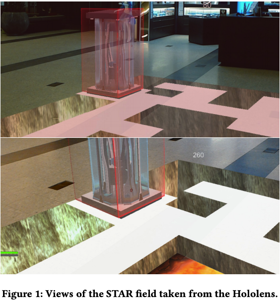
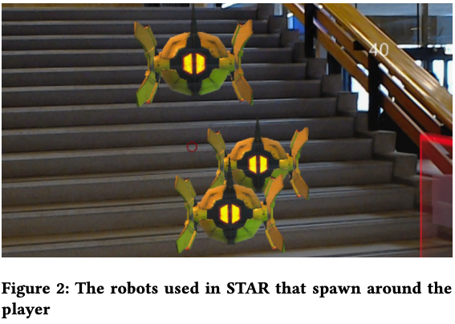
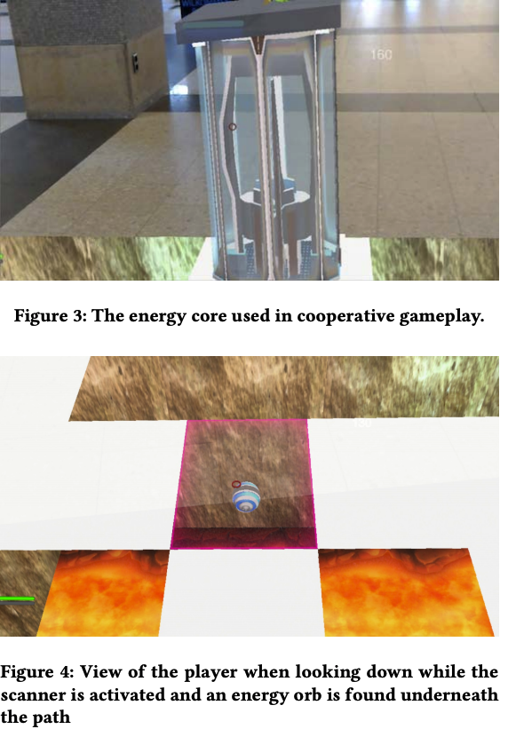

# STAR: Superhuman Training in Augmented Reality
This is code for superhuman sports game called "STAR" which is a step taken towards making people exercise while gaming. The main aspects of a superhuman game are described here:

http://superhuman-sports.org/delft/

The associated research paper:

https://graphics.tudelft.nl/Publications-new/2018/KMRSBLB18/a7-kegeleers.pdf

A smaller version of game was also tested out at the International Festival of Technology, TU Delft. 

